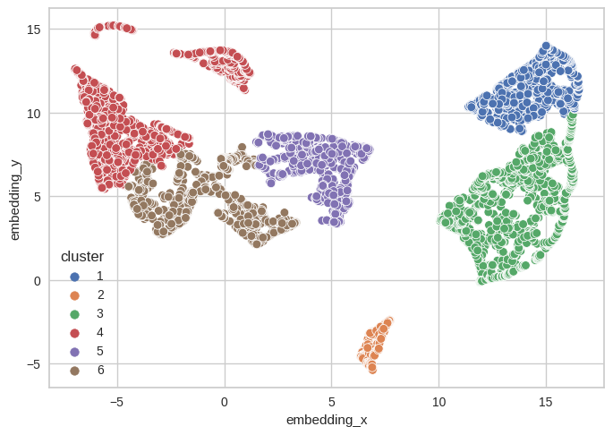
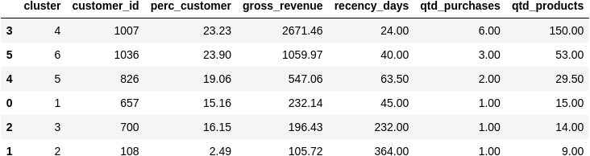
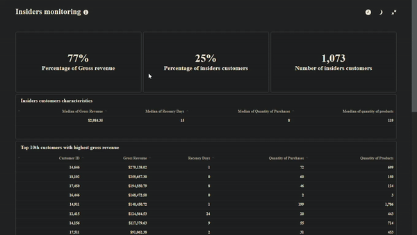

# High customers identification

## 1. Introduction
This is an end-to-end data science project which a clusterization algorithm was used to select most valuable customers in order to create a loyalty program called insiders. Also, a dashboard in Metabase was created to monitoring these customers and their metrics. This dashboard is hosted in a EC2 service provided by AWS.

# 2. Business Problem.

A UK online retail store who sells differents types of products across world would like to know who are their most valuable customers in order to create a loyalty program to them. This program would be called Insiders. In order to do that, they need to make a customer segmentation to see who customers are eligible for become a insiders.

They would like a report answering these questions:

* Who are the eligible customers to participate in the Insiders program?

* How many customers will be part of the program?

* What are the main characteristics of these customers?

* What revenue percentage comes from Insiders?

* What are the conditions for a customer to be eligible for the Insiders program?

* What are the conditions for a customer to be removed from the Insiders program?

* What is the guarantee that the Insiders program is better than the regular customer database?

* What actions can the marketing team make to increase the revenue?

# 3. Business Assumptions.

* Invoice starting with letter C was considered as returned purchases and they are removed from the dataset in this first moment. It was just considered purchases that did not have returns.

* Stock codes with just letter (D,M,m) and letter and numbers were removed from dataset as they do not represents products but operations like discount. Also, stock codes like POST,DOT,BANK CHARGES,PADS and AMAZONFEE were removed.

* Negative product quantity was removed since appears that they were products in stock but were lost, broken or anything happened to them. These situation does not represent a customer purchase.

* Prices equal to zero were removed from the dataset as most of these situations do not have neither a customer ID nor product description and therefore do not seem normal purchases.

* About 20% of the whole data do not have customer ID. To avoid loosing these data it was created artifical customers ID starting with number 25000. 

* The country column was removed due to 98% of customers come from UK so this is a high imbalanced data.

# 4. Tools used
* Python
* Jupyter Lab / Jupyter Notebook
* Git and Github
* Sklearn
* Metabase BI
* AWS

# 5. Dataset

This is a transnational dataset that contains all the transactions occurring between Nov-2016 to Dec-2017. There are 541,909 rows and 8 columns. Each row represent a product purchased in a invoice number.

* invoice_no - number of invoice

* stock_code - ID of product

* description -	product description

* quantity - quantity of product

* invoice_date - date of purchase

* unit_price - product price

* country - country of customer

* customer_id - ID of customer

# 6. Solution Strategy

THe strategy to solve this was:

This project was developed following CRISP-DM (Cross-Industry Standard Process - Data Science) framework. This framework has these steps:

* Business Understanding;
* Data Collection;
* Data Cleaning;
* Exploratory Data Analysis (EDA);
* Data Preparation;
* Machine Learning Modelling and fine-tuning;
* Model and Business performance evaluation / Results;
* Model deployment

However since this was a clusterization problem this framework was adapted in following steps:

* Business Understanding;
* Data Collection;
* Data Cleaning;
* Feature engineering;
* Exploratory Data Analysis (EDA);
* Feature selection;
* Data preparation;
* Hyperparameter tunning;
* Model training and evaluation;
* Exploratory Data Analysis (EDA) with hypothesis;
* Business questions;
* Model deployment;

**Step 1. Business Understanding:** Understand business context, get questions that need to be answered.

**Step 2. Data Collection:** Getting data from database or CSV files.

**Step 3. Data description and cleaning:** Seeing dimensions of data, checking existence of NAs, number of rows and columns. Fillout NAs, altering columns names,  Descriptive statistics.

**Step 4. Feature engineering:** Creation of new features based on features already in data.

**Step 5. Feature engineering:** Creation of a mindmap hypothesis with all variables and values that could have impact on sales. After that, some features was created from current ones.

**Step 6. Exploratory Data Analysis (EDA):** Univariate, bivariate and multivariate analysis.

**Step 7. Feature selection:** Selecting features that will improve model accuracy or would be important to business.

**Step 8. Data preparation:** Rescaling and encoding features so they could be used in machine learning algorithms properly. 

**Step 9. Hyperparameter tunning:** Random search techniques was used to find out the number of cluster that maximizes silhouette score. Also it was tested embedding spaces to check improvements in silhouette score.

**Step 10. Model training and evaluation:** Training final model with the number of cluster found out in previous step.

**Step 11. Exploratory Data Analysis (EDA) with hypothesis:**
Creation of a mindmap hypothesis with all variables that could have impact on customer segmentation. Besides it serves to find out insights to business about some customer characteristics.

**Step 12. Business questions:** Answer business questions asked.

**Step 13. Deploy mode to production**: Model was deployed in a cloud environment (AWS) so from time to time it could be used to see which customers will join insiders program and which ones will be removed.

# 7. Top 3 Data Insights

**Hypothesis 01:** Insiders customers contribute with more than 30% of total gross revenue

**True/False:** True. Customers insiders represent 71% of total gross revenue. This means that 20% of customers contribute with 71% of revenue.  

**Hypothesis 02:** The median of insiders customers gross revenue is 30% greater than the median gross revenue

**True/False:** True. The median of insiders customers gross revenue is approximately 400% (or 4 times) greater than gross revenue of all customers

**Hypothesis 03:** The median of quantity of distinct products bought from insiders costumers is 30% greater than the median of all other clusters

**True/False:** True. The median of insiders customer distinct products bought is 128 products and the median of all customers is 36 distinct products.

# 8. Machine Learning Model Applied and performance
It was used an embedding space to test some models since in this space data seems to be more organized to make clusters. The UMAP technique was to create a two-dimensional embedding space. After that, some clusterization algorithms were tested to see which get highest silhoutte scores. It was tested K-Means, Gaussian Mixture Model (GMM), Hierarchical clustering (HC) and DBSCAN. In the table below there is silhoutte scores for each model and for each number of clusters.

The model choosen was K-Means with 5 clusters. Its silhoutte score is 0.52. It is possible to see silhoutte plot as show below

In the plot below one can see the clusters, being insiders cluster number 0.

In table below there are the median of each characteristics of each cluster.

# 9. Business Results
The business report answering are the following:

* Who are the eligible customers to participate in the Insiders program?

    **There is a list of customers based on their ID that will be handed to business people showing the eligible ones to Insiders program.**

* How many customers will be part of the program?

    **1073 customers (about 25% of all customers)**

* What are the main characteristics of these customers?

    **Median of gross_revenue: £2984.35**\
    **Median of Recency: 15 days**\
    **Median of quantity of purchases in one year: 8 purchases**\
    **Median of quantity of distinct products bought: 119 products**  

* What revenue percentage comes from Insiders?
   **75% of gross revenue comes from Insiders customers**

* What are the conditions for a customer to be eligible for the Insiders program?\
    **To be a insider a customer should have at least 3 out of the 4 main characteristics greater than the lowest value.**

   **The minimum values of each attribute are the following:**

    **- For gross revenue > £1931**\
    **- For recency days > 32 days**\
    **- For quantity of purchases in a year > 6 purchases**\
    **- For quantity of unique products > 73 different products**

* What are the conditions for a customer to be removed from the Insiders program?

    **To leave insiders program customer did not accomplish at least the minimum values in 3 out of 4 attributes to be a insider.**

* What is the guarantee that the Insiders program is better than the regular customer database?

    **- The insiders customers gross revenue represent 75% of the total gross revenue of the company.**  

    **- The median of insiders customers gross revenue is approximately 4 times greater than the median gross revenue of all customers.**

    **- They bought more distinct product, on average, than a regular customer. In fact, the median of insiders customers quantity of distinct products bought is approximately 4 times greater than the median of all clusters.**

    **- They make much more purchases in a year than a regular customer. The mean of purchases of a insider customer is 8 purchases, while the mean of rest of the customers is 2 purchases in a year.**

    **- The median of recency days of a insider customer is 24 days, while the other customers is 100 days.**

    **- Also, it has been done statistical hypothesis on each of characteristics to compare mean of all customers except insiders and mean of insiders customers in order to see if, in fact, insiders customers have attributes different from the rest of customers.** 

* What actions can the marketing team make to increase the revenue?

    **The idea is to bring other customers as close as possible of insiders cluster. Therefore, other customers need to improve their attribute depending on what cluster they are. Some suggestions are:**

    **- Cluster 6 (Cluster more products) - Cross-selling actions to increase gross revenue and number of distinct products.**

    **-Cluster 5 (Cluster even more products ) - Cross-selling actions to increase gross revenue and number of distinct products.**

    **-Cluster 1 (Cluster more purchases) - Give coupons and discounts.**

A dashboard was created in Metabase to monitoring these metrics as it is showed below:

# 10. Conclusions

The model did a good job finding insiders customers and their characteristics. Also it would help company does more selective actions to customers such as marketing campaigns, cross-selling and up-selling actions. That way it could reduce churn and increase revenue.

# 11. Next Steps to Improve

The next CRISP-DM circle one can do the following:

* Trying to get more features from database that was wrote down in mindmap hypothesis about customers, purchases and products such as payment methods, job, age, gender, education, cost of product.

* Using return invoices to see if number of returns is a variable that could improve customer segmentation

